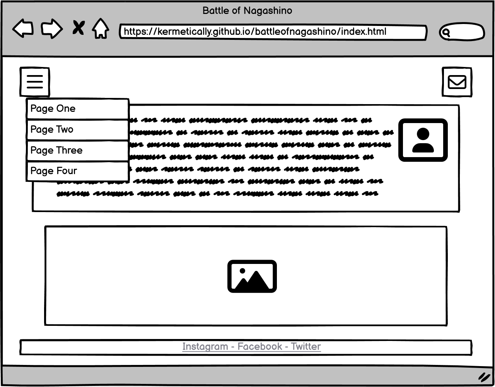
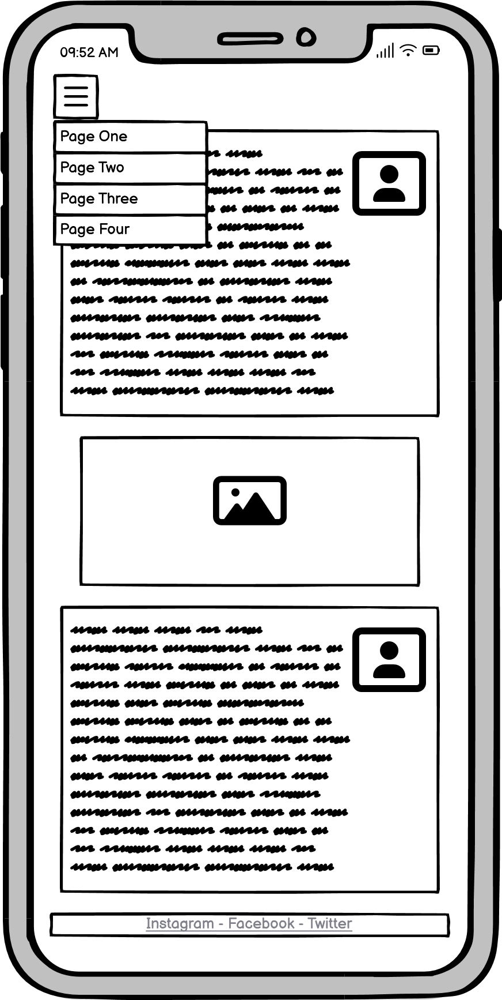
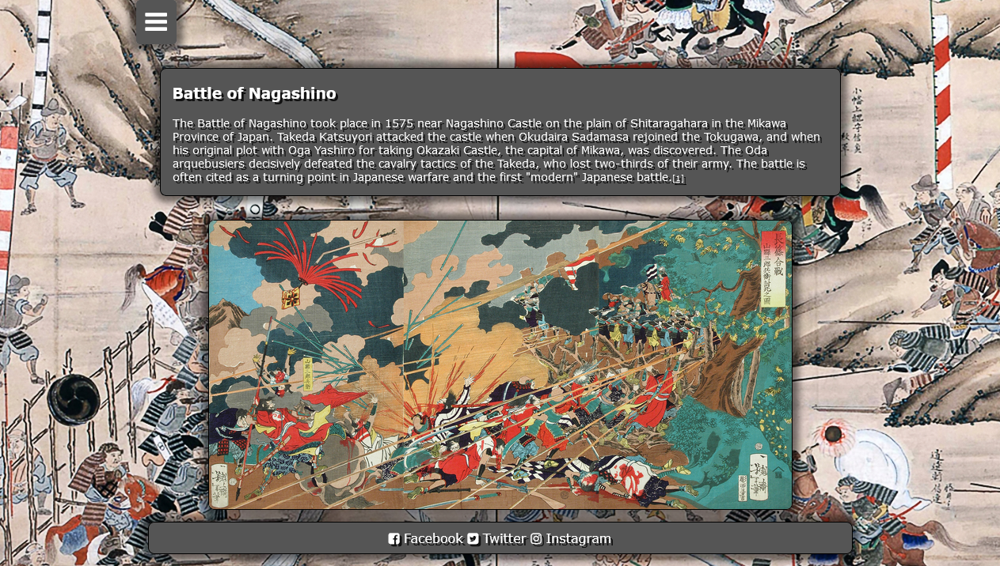
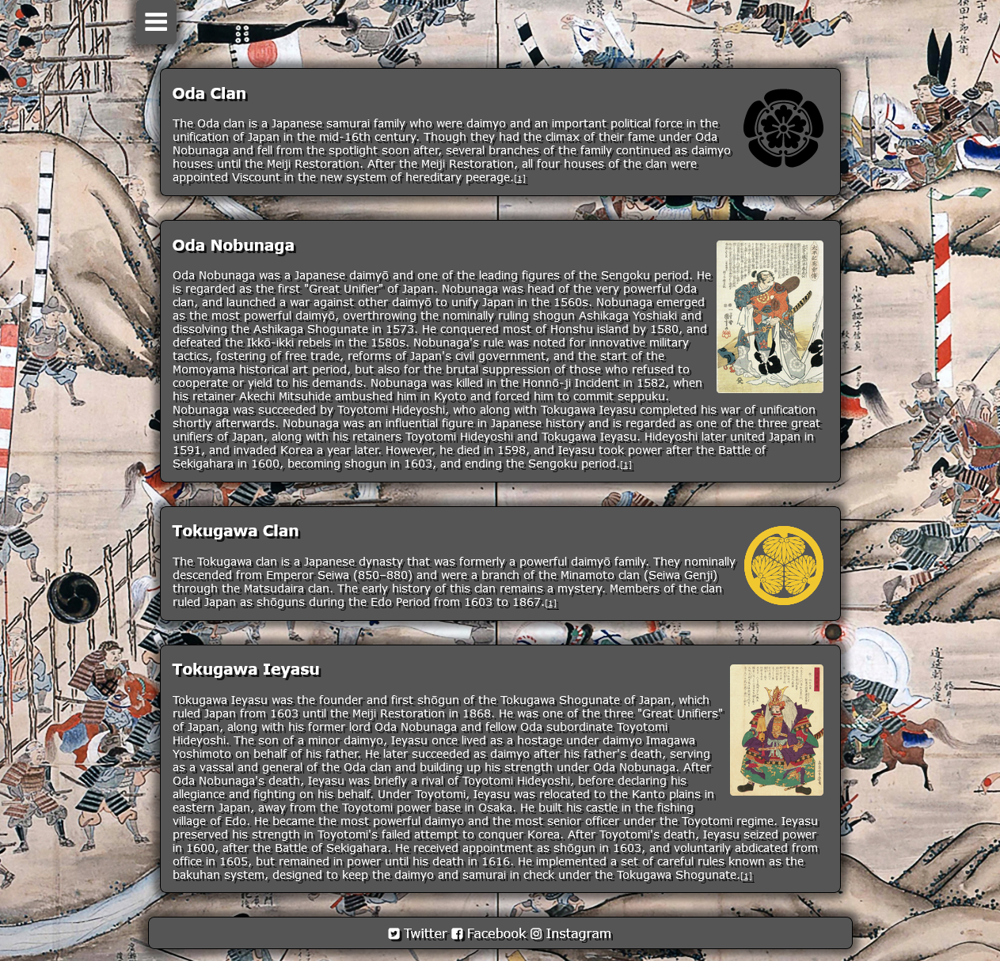
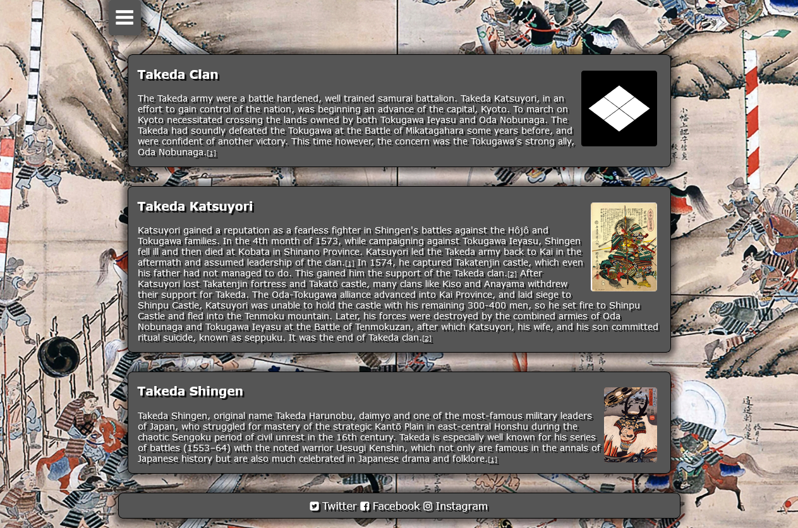
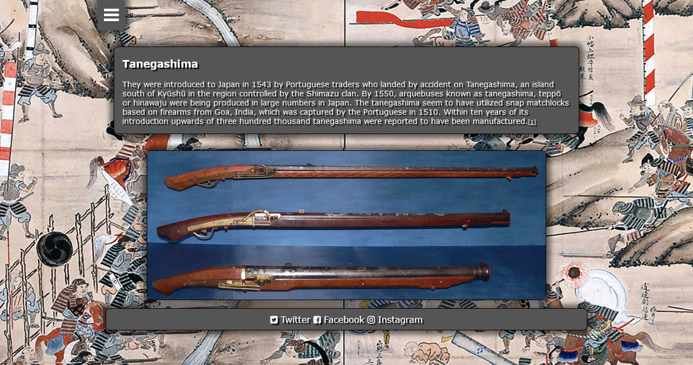

# The Battle of Nagashino

https://kermetically.github.io/battleofnagashino/index.html

The Battle of Nagashino is a site where you can learn about the events of the battle of Nagashino during the Sengoku period in Japanese history and the key people and families involved. It was a turning piont in japanese history with the use of firearms.

## Wireframe

 

## UX

- You'll see the Navigation Button and Menu on all five pages, containing the links to each of the clans and key people and technologies in the battle, and is identical in each page to allow for easy navigation.
- On every page youll find the contact button which will take you to the contact form page.
- It will allow the user to easily navigate from page to page across all devices without having to revert back to the previous page via the ‘back’ button.

## Icons

- The icons used in the menu button and contact button and footer were taken from [Font Awesome](https://fontawesome.com/)

## Font

- I used Futura and Verdana fonts because they looked most pleasing to my eye and didn't need the use of some external font library.

## Colors

- I chose the colors on my site to be neutral and not to distract from the images or text itself.

## Sources

- The sources used for my site were from Wikipedia and other websites covering this historical event which are all cited in my site.

## Imagery

- The background image is an illustration of the battle of Nagashino. I used it since its bigger than most device resolutions and brings the site to life a bit more. Using a feature of css the background image stays in place as you scroll and gives the site a 3 dimensional aspect.

### Features Left to Implement

I would have liked the background image to have been a bit more zoomed out to take advantage of more high resolution displays.

## Testing

I tested this site on an iPhone 12 and a Lenovo laptop and I also used the below mentioned validators which prompted me to put in the alt text with images.

### Validator Testing

- HTML
  - No errors were returned when passing through the official [W3C validator](https://validator.w3.org/nu/?doc=https%3A%2F%2Fkermetically.github.io%2Fbattleofnagashino%2Findex.html)
- CSS
  - No errors were found when passing through the official [CSS validator](http://jigsaw.w3.org/css-validator/validator?lang=en&profile=css3svg&uri=https%3A%2F%2Fkermetically.github.io%2Fbattleofnagashino%2Fstyle.css&usermedium=all&vextwarning=&warning=1)

### Known Bugs

- On a touchscreen device when you tap on the menu button but don't go to a link in the menu its unclear as to how to close the menu.
- The images could be compressed but I didnt want to reduce the quality of the images

## Deployment

- The site was deployed to GitHub pages.
- I used Notepad to type out my code and then Visual Studio and the Prettier extension to basically remove witespace.
- w3schools.com was a useful resource and helped with making the navgation button menu and CSS box and shadows.
- I used Balsamiq to make the wireframes.

## Credits

- Most of the images for the site came from Wikimedia commons or Wikipedia.
